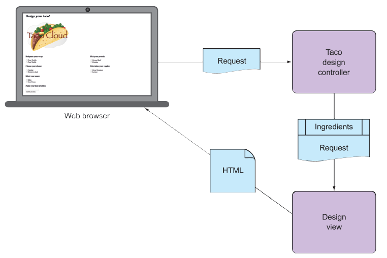

# 2.1 展示信息

从根本上说，Taco Cloud 是一个可以在线订购玉米卷的地方。但除此之外，Taco Cloud 还希望让顾客能够表达自己的创意，从丰富的配料中设计定制的玉米卷。

因此，Taco Cloud web应用程序需要一个页面来显示玉米卷制作艺术家可以从中选择的配料。选择的原料可能随时改变，所以不应该硬编码到 HTML 页面中。相反，应该从数据库中获取可用配料的列表，并将其提交给页面以显示给客户。

在 Spring web 应用程序中，获取和处理数据是控制器的工作。视图的工作是将数据渲染成 HTML 并显示在浏览器中。将创建以下组件来支持 Taco 创建页面：

* 一个定义玉米卷成分特性的领域实体类
* 一个 Spring MVC 控制器类，它获取成分信息并将其传递给视图
* 一个视图模板，在用户的浏览器中呈现一个成分列表

这些组件之间的关系如图 2.1 所示。

**图 2.1 典型 Spring MVC 请求流程**  

由于本章主要讨论 Spring 的 web 框架，所以我们将把数据库的内容推迟到第 3 章。现在，控制器将单独负责向视图提供组件。在第 3 章中，将重写控制器，使其与从数据库中获取配料数据的存储库进行协作。

在编写控制器和视图之前，让我们先确定表示配料的域类型。这将为开发 web 组件奠定基础。

