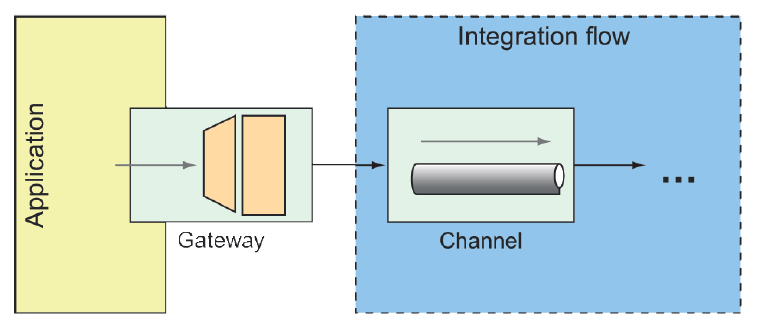

# 10.2.7 网关

网关是通过一个应用程序可以将数据提交到一个集成信息流和接收这是该流的结果的响应的装置。通过 Spring Integration 实现的，网关是实现为应用程序可以调用将消息发送到集成信息流的接口（如图 10.8）。



**图 10.8 服务网关是应用程序可以通过其向用户提交消息的接口整合流程。** <br/>

您已经见过 FileWriterGateway 消息网关的例子。FileWriterGateway 是单向网关，它的方法接受 String 作为参数，将其写入到文件中，返回 void。同样，编写一个双向网关也很容易。当写网关接口时，确保该方法返回某个值发布到集成流程即可。

作为一个例子，假设一个网关处理接受一个 String 的简单集成信息流，并把特定的 String 转成大写。网关接口可能是这个样子：

```java
package sia6;
import org.springframework.integration.annotation.MessagingGateway;
import org.springframework.stereotype.Component;

@Component
@MessagingGateway(defaultRequestChannel="inChannel",
        defaultReplyChannel="outChannel")
public interface UpperCaseGateway {
  String uppercase(String in);
}
```

令人惊叹的是，没有必要实现这个接口。Spring Integration 自动提供运行时实现，这个实现会使用特定的通道进行数据的发送与接收。

当 `uppercase()` 被调用时，给定的 String 被发布到名为 inChannel 的集成流通道中。而且，不管流是如何定义的或是它是做什么的，在当数据到达名为 outChannel 通道时，它从 `uppercase()` 方法中返回。

至于 uppercase 集成流，它只有一个单一的步骤，把 String 转换为大写一个简单的集成流。以下是使用 Java DSL 配置：

```java
@Bean
public IntegrationFlow uppercaseFlow() {
  return IntegrationFlows
    .from("inChannel")
    .<String, String> transform(s -> s.toUpperCase())
    .channel("outChannel")
    .get();
}
```

正如这里所定义的，流程启动于名为 inChannel 的通道获得数据输入的时候。然后消息的有效负载通过转换器去执行变成大写字母的操作，这里的操作都使用 lambda 表达式进行定义。消息的处理结果被发布到名为 outChannel 的通道中，这个通道就是已经被声明为 UpperCaseGateway 接口的答复通道。

