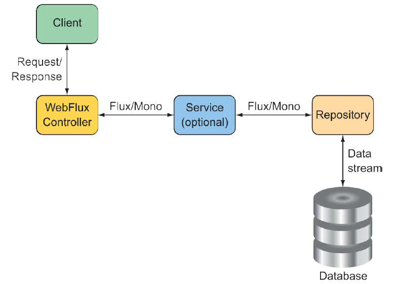

# 12.1.2 编写响应式 Controller

您可能还记得，在第 7 章中，您为 Taco Cloud 的 REST API 创建了一些 controller。这些 controller 具有处理请求的方法，这些方法根据域类型（如 Order 和 Taco）或域类型的集合，处理输入和输出。提醒一下，请考虑您在第 7 章中写过的 DesignTacoController 中的以下片段：

```java
@RestController
@RequestMapping(path="/api/tacos",
      produces="application/json")
@CrossOrigin(origins="*")
public class TacoController {

...

  @GetMapping(params="recent")
  public Iterable<Taco> recentTacos() {
    PageRequest page = PageRequest.of(
          0, 12, Sort.by("createdAt").descending());
    return tacoRepo.findAll(page).getContent();
  }

...

}
```

如前所述，`recentTacos()` controller 处理 `/design/recent` 的 HTTP GET 请求，以返回最近创建的 tacos 的列表。更具体地说，它返回一个 Iterable 类型的 Taco。这主要是因为这是从 respository 的 `findAll()` 方法返回的，或者更准确地说，是从 `findAll()` 返回的页面对象的 `getContent()` 方法返回的。

这很好，但是 Iterable 不是一个响应式的。您将不能对它应用任何响应式操作，也不能让框架利用它作为响应式类型在多个线程上分割任何工作。您想要的是 `recentTacos()` 返回一个 `Flux<Taco>`。

这里有一个简单但有点有限的选项，就是重写 `recentTacos()` 将 Iterable 转换为 Flux。而且，当您使用它时，可以去掉分页代码，并用调用 `take()` 来替换它：

```java
@GetMapping(params="recent")
public Flux<Taco> recentTacos() {
  return Flux.fromIterable(tacoRepo.findAll()).take(12);
}
```

使用 `Flux.fromIterable()`，可以将 `Iterable<Taco>` 转换为 `Flux<Taco>`。现在您正在使用一个 Flux，可以使用`take()` 操作将返回的 Flux 限制为最多 12 个 Taco 对象。不仅代码简单，它还处理一个响应式 Flux，而不是一个简单的 Iterable。

迄今为止，编写响应式代码是一个成功的举措。但是，如果 repository 提供了一个可以开始使用的 Flux，那就更好了，这样就不需要进行转换。如果是这样的话，那么 `recentTacos()` 可以写成如下：

```java
@GetMapping(params="recent")
public Flux<Taco> recentTacos() {
  return tacoRepo.findAll().take(12);
}
```

那就更好了！理想情况下，一个响应式 cotroller 将是一个端到端的响应式栈的顶端，包括 controller、repository、database 和任何可能位于两者之间的 serviec。这种端到端的响应式栈如图 12.3 所示：


**图 12.3 为了最大限度地发挥响应式 web 框架的优势，它应该是完整的端到端响应式堆栈的一部分。**

这样的端到端的栈要求 repository 被写入以返回一个 Flux，而不是一个Iterable。在下一章中，我们将探讨如何编写响应式 repostitory，但下面我们将看一看响应式 TacoRepository 可能是什么样子：

```java
package tacos.data;

import org.springframework.data.repository.reactive.ReactiveCrudRepository;
import tacos.Taco;

public interface TacoRepository
      extends ReactiveCrudRepository<Taco, Long> {
}
```

然而，在这一点上，最重要的是，除了使用 Flux 而不是 Iterable 以及如何获得 Flux 外，定义响应式 WebFlux controller 的编程模型与非响应式 Spring MVC controller 没有什么不同。两者都用 @RestController 和类级别的 @RequestMapping 进行了注解。它们都有请求处理函数，在方法级别用 @GetMapping 进行注解。真正的问题是处理程序方法返回什么类型。

另一个要做的重要观察是，尽管从 repository 中获得了一个 `Flux<Taco>`，但您可以在不调用 `subscribe()` 的情况下返回它。实际上，框架将为您调用 `subscribe()`。这意味着当处理对 `/api/tacos?recent` 的请求时，`recentTacos()` 方法将被调用，并在从数据库中获取数据之前返回！

**返回单个值**

作为另一个例子，请考虑 DesignTacoController 中的 tacoById() 方法，如第 6 章中所述：

```java
@GetMapping("/{id}")
public Taco tacoById(@PathVariable("id") Long id) {
  Optional<Taco> optTaco = tacoRepo.findById(id);
  if (optTaco.isPresent()) {
    return optTaco.get();
  }
  return null;
}
```

在这里，这个方法处理 `/design/{id}` 的 GET 请求并返回一个 Taco 对象。因为 repository 的 `findById()` 返回一个 Optional，所以还必须编写一些笨拙的代码来处理这个问题。但是假设 `findById()` 返回 `Mono<Taco>` 而不是 `Optional<Taco>`。在这种情况下，可以重写 controller 的 `tacoById()`，如下所示：

```java
@GetMapping("/{id}")
public Mono<Taco> tacoById(@PathVariable("id") Long id) {
  return tacoRepo.findById(id);
}
```

哇！这就简单多了。然而，更重要的是，通过返回 `Mono<Taco>` 而不是 Taco，可以使 Spring WebFlux 以一种被动的方式处理响应。因此，您的API将更好地响应大的负载。

**使用 RxJava 类型**

值得指出的是，虽然在使用 Spring WebFlux 时，像 Flux 和 Mono 这样的 Reactor 类型是一个自然的选择，但是您也可以选择使用像 Observable 和 Single 这样的 RxJava 类型。例如，假设 DesignTacoController 和后端 repository 之间有一个 service，它处理 RxJava 类型。在这种情况下，`recentTacos()` 方法的编写方式如下：

```java
@GetMapping(params = "recent")
public Observable<Taco> recentTacos() {
  return tacoService.getRecentTacos();
}
```

类似地，可以编写 `tacoById()` 方法来处理 RxJava 的 Single 元素，而不是 Mono：

```java
@GetMapping("/{id}")
public Single<Taco> tacoById(@PathVariable("id") Long id) {
  return tacoService.lookupTaco(id);
}
```

此外，Spring WebFlux controller 方法还可以返回 RxJava 的 Completable，这相当于 Reactor 中的 `Mono<Void>`。WebFlux 还可以返回一个 Flowable，作为 Observable 或 Reactor 的 Flux 的替代。

**响应式地处理输入**

到目前为止，我们只关心控制器方法返回的响应式类型。但是使用 Spring WebFlux，您还可以接受 Mono 或 Flux 作为处理程序方法的输入。请考虑 DesignTacoController 中 `postTaco()` 的原始实现：

```java
@PostMapping(consumes="application/json")
@ResponseStatus(HttpStatus.CREATED)
public Taco postTaco(@RequestBody Taco taco) {
  return tacoRepo.save(taco);
}
```

正如最初编写的，`postTaco()` 不仅返回一个简单的 Taco 对象，而且还接受一个绑定到请求主体内容的 Taco 对象。这意味着在请求有效负载完全解析并用于实例化 Taco 对象之前，无法调用 `postTaco()`。这也意味着 `postTaco()` 在对 repository 的 `save()` 方法的阻塞调用，在返回之前无法返回。简言之，请求被阻塞了两次：当它进入 `postTaco()` 时，然后在 `postTaco()` 内部被再次阻塞。但是，通过对 `postTaco()` 应用一点响应式编码，可以使其成为一种完全无阻塞的请求处理方法：

```java
@PostMapping(consumes = "application/json")
@ResponseStatus(HttpStatus.CREATED)
public Mono<Taco> postTaco(@RequestBody Mono<Taco> tacoMono) {
  return tacoRepo.saveAll(tacoMono).next();
}
```

在这里，`postTaco()` 接受 `Mono<Taco>` 并调用 repository 的 `saveAll()` 方法，正如您将在下一章中看到的，该方法接受 Reactive Streams Publisher 的任何实现，包括 Mono 或 Flux。`saveAll()` 方法返回一个 `Flux<Taco>`，但是因为是从 Mono 开始的，所以 Flux 最多会发布一个 Taco。因此，您可以调用 `next()` 来获取将从 `postTaco()` 返回的 `Mono<Taco>`。

通过接受 `Mono<Taco>` 作为输入，可以立即调用该方法，而无需等待 Taco 从请求体被解析。由于 repository 也是被动的，它将接受一个 Mono 并立即返回一个 `Flux<Taco>`，从中调用 `next()` 并返回 `Mono<Taco>`。所有这些都是在处理请求之前完成的！

或者，您也可以像这样实现 `postTaco()`：

```java
@PostMapping(consumes = "application/json")
@ResponseStatus(HttpStatus.CREATED)
public Mono<Taco> postTaco(@RequestBody Mono<Taco> tacoMono) {
  return tacoMono.flatMap(tacoRepo::save);
}
```
这种方法将事情翻转过来，使 tacoMono 成为行为的驱动者。tacoMono 中包含的 Taco 通过 `flatMap()` 传递给 repository 的 `save()` 方法，导致返回一个新的 `Mono<Taco>`。

任何一种方法都有效，`postTaco()` 可能还有其他几种写法，选择对您最容易理解的方法就好。

Spring WebFlux 是 Spring MVC 的一个极好的替代品，它提供了使用与 Spring MVC 相同的开发模型编写响应式 web 应用程序的选项。不过，Spring  还有另一个新的窍门。让我们看看如何使用 Spring 的新函数式编程风格创建响应式 API。

